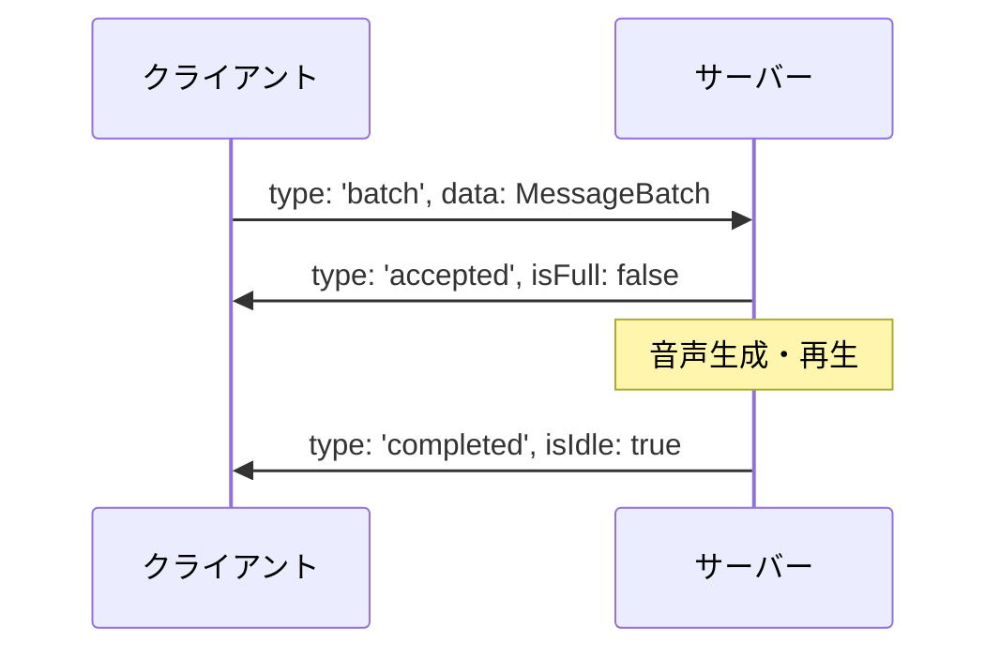
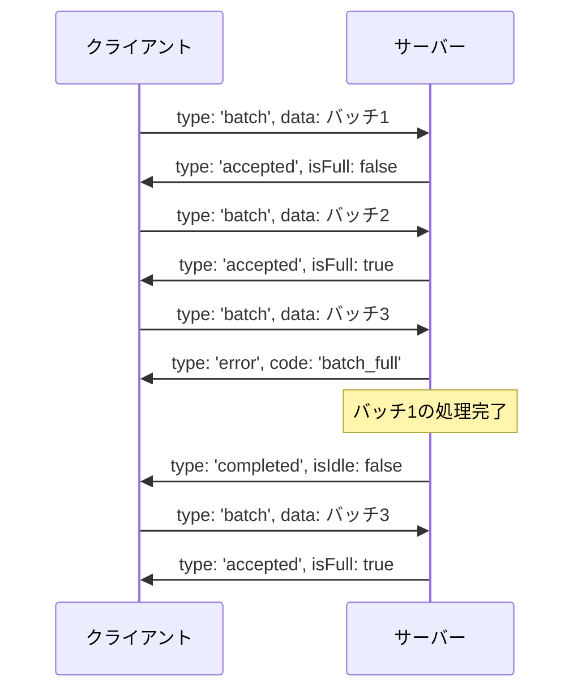
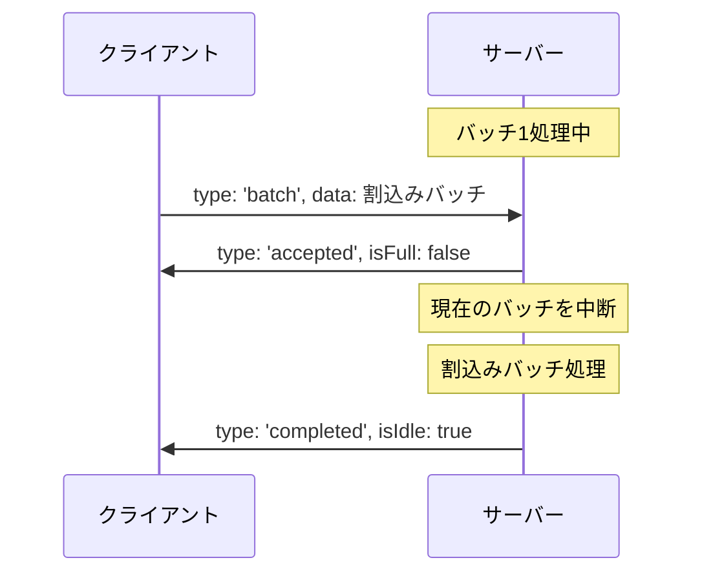
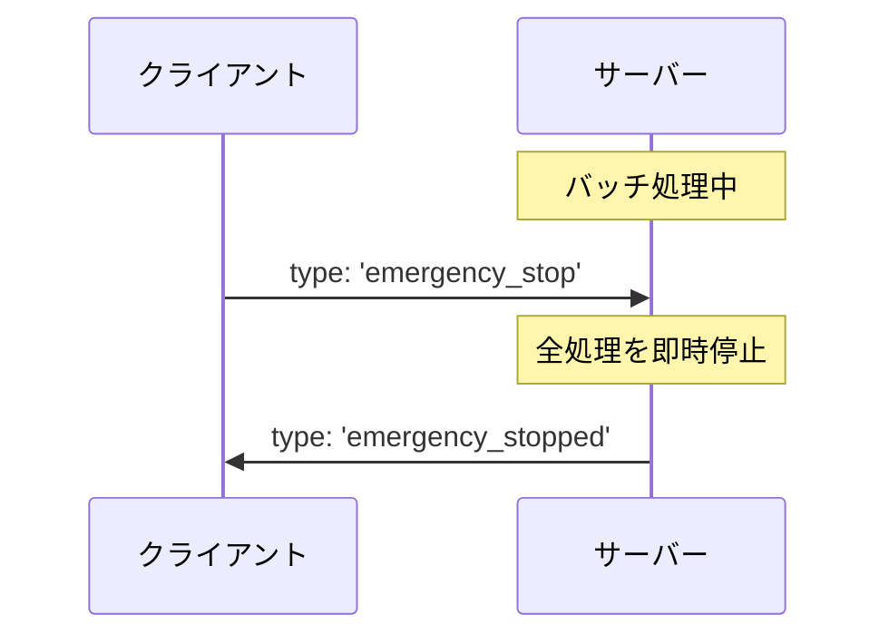
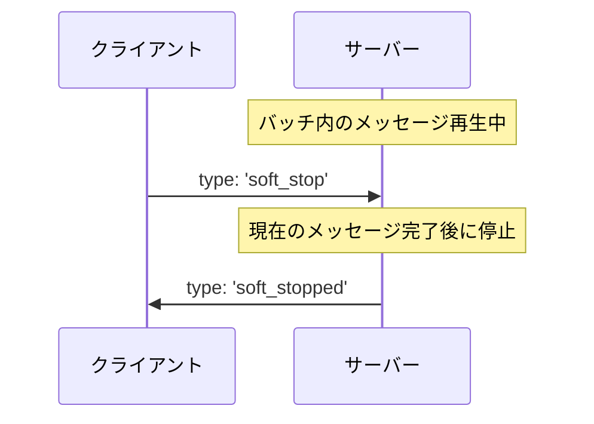

# WebSocket通信仕様書

## 1. 概要

この仕様書は、外部プログラムから本アプリケーションとWebSocketを使って通信するための方法を説明します。
WebSocketを使うことで、テキストメッセージや音声合成のリクエストをリアルタイムに送信できます。

## 2. 接続情報

### 2.1 接続先

```
ws://localhost:8082
```

※ホストとポートは設定画面から変更可能です（デフォルト: localhost:8082）

### 2.2 接続フロー

1. クライアントからサーバーへ接続を開始
2. 接続確立後、メッセージの送受信が可能に
3. 接続が切れた場合は、クライアント側で再接続処理を実装する必要があります（サーバー側では自動再接続処理は行いません）

## 3. メッセージ形式

### 3.1 クライアント → サーバー（リクエスト）

すべてのメッセージはJSON形式で送信します。

#### 3.1.1 テキスト表示・音声再生リクエスト

##### 単一メッセージの例（バッチ内に1つのメッセージ）

```json
{
  "type": "batch",
  "data": {
    "messages": [
      {
        "characterId": 1,       // キャラクターID（必須）
        "emotionId": 2,         // 感情ID（必須）
        "voiceId": 3,           // 音声ID（必須）
        "message": "こんにちは！" // 表示テキスト（必須）
      }
    ],
    "isInterrupt": false        // 割込みバッチかどうか（デフォルト: false）
  }
}
```

##### 複数メッセージの例（バッチ内に複数のメッセージ）

```json
{
  "type": "batch",
  "data": {
    "messages": [
      {
        "characterId": 1,       // キャラクターID（必須）
        "emotionId": 2,         // 感情ID（必須）
        "voiceId": 3,           // 音声ID（必須）
        "message": "こんにちは！" // 表示テキスト（必須）
      },
      {
        "characterId": 1,
        "emotionId": 3,         // 異なる感情ID
        "voiceId": 3,
        "message": "今日はいい天気ですね。"
      },
      {
        "characterId": 2,       // 異なるキャラクターID
        "emotionId": 1,
        "voiceId": 4,           // 異なる音声ID
        "message": "そうですね！"
      }
    ],
    "isInterrupt": false
  }
}
```

**重要**: キャラクターID、感情ID、音声IDは必須パラメータです。これらのIDは事前にアプリケーション側で設定しておく必要があります。有効なIDでない場合、`invalid_batch`エラーが返されます。これらのIDを取得する方法については、アプリケーションの設定画面を確認してください。

#### 3.1.2 緊急停止リクエスト

```json
{
  "type": "emergency_stop"
}
```

**緊急停止**: 現在再生中のメッセージを含む、すべてのメッセージを即座に停止します。音声再生とキャラクター表示が即時に終了します。

#### 3.1.3 ソフト停止リクエスト

```json
{
  "type": "soft_stop"
}
```

**ソフト停止**: 現在再生中のメッセージは最後まで再生を完了させますが、次のメッセージおよび待機中のバッチはすべてキャンセルされます。現在のメッセージが終了した時点で停止となります。

### 3.2 サーバー → クライアント（レスポンス）

#### 3.2.1 受付成功

```json
{
  "type": "accepted",
  "isFull": false  // バッチスロットが満杯かどうか
}
```

#### 3.2.2 処理完了

```json
{
  "type": "completed",
  "isIdle": true  // 処理完了後、次のバッチがない状態か
}
```

#### 3.2.3 停止完了

```json
{
  "type": "soft_stopped"
}
```

または

```json
{
  "type": "emergency_stopped"
}
```

#### 3.2.4 エラー

```json
{
  "type": "error",
  "code": "batch_full" // エラーコード
}
```

エラーコード:
- `batch_full`: バッチ処理枠が満杯
- `invalid_batch`: バッチの内容が不正
- `internal_error`: 内部処理エラー

## 4. バッチ処理の仕組み

### 4.1 バッチとは

「バッチ」は複数のメッセージをまとめて処理する単位です。1つのバッチには複数のメッセージを含めることができ、それらは順番に処理されます。

### 4.2 バッチ処理の状態と制約

- 同時に処理できるバッチは最大2つまで
  - 現在処理中のバッチ
  - 次に処理予定のバッチ

| 状態 | 説明 | 新規バッチの受付 |
|------|------|-----------------|
| 空き状態 | バッチ処理なし | ✅ 可能 |
| 単一バッチ処理中 | 1つのバッチを処理中 | ✅ 可能 |
| 満杯状態 | 2つのバッチを保持中 | ❌ 不可 |

### 4.3 特殊なバッチ：割込みバッチ

割込みバッチを送信すると、現在処理中のバッチや待機中のバッチを中断して、すぐに処理を開始します。

```json
{
  "type": "batch",
  "data": {
    "messages": [
      {
        "characterId": 1,
        "emotionId": 2,
        "voiceId": 3,
        "message": "重要なお知らせです！"
      }
    ],
    "isInterrupt": true  // ← ここをtrueに設定
  }
}
```

### 4.4 停止処理の違い

#### 緊急停止とソフト停止の比較

| 項目 | 緊急停止 (`emergency_stop`) | ソフト停止 (`soft_stop`) |
|------|---------------------------|------------------------|
| 現在再生中のメッセージ | 即座に停止 | 最後まで再生を完了 |
| 待機中のメッセージ | すべて破棄 | すべて破棄 |
| 待機中のバッチ | すべて破棄 | すべて破棄 |
| 音声再生 | 即座に停止 | 現在のメッセージは継続 |
| キャラクター表示 | 即座に非表示/初期状態に戻る | 現在のメッセージ終了まで表示 |
| 復帰方法 | 新たなバッチの送信が必要 | 新たなバッチの送信が必要 |

## 5. 通信シーケンス例

### 5.1 正常系



### 5.2 バッチ満杯時



### 5.3 割込みバッチ処理



### 5.4 緊急停止処理



### 5.5 ソフト停止処理



## 6. サンプルコード

### 6.1 JavaScriptでの接続例

```javascript
// WebSocketクライアントの作成
const ws = new WebSocket('ws://localhost:8082');

// 接続時の処理
ws.onopen = () => {
  console.log('接続しました');
  
  // メッセージ送信例
  const message = {
    type: 'batch',
    data: {
      messages: [
        {
          characterId: 1,
          emotionId: 2,
          voiceId: 3,
          message: "こんにちは！"
        }
      ],
      isInterrupt: false
    }
  };
  
  ws.send(JSON.stringify(message));
};

// メッセージ受信時の処理
ws.onmessage = (event) => {
  const response = JSON.parse(event.data);
  console.log('応答を受信:', response);
  
  // 応答に応じた処理
  if (response.type === 'completed') {
    console.log('メッセージの処理が完了しました');
  }
};

// エラー発生時の処理
ws.onerror = (error) => {
  console.error('エラーが発生しました:', error);
};

// 接続が閉じられた時の処理
ws.onclose = () => {
  console.log('接続が閉じられました');
  
  // 再接続が必要な場合は、ここで再接続処理を実装する
  // 例: setTimeout(() => { /* 再接続処理 */ }, 3000);
};
```

### 6.2 Pythonでの接続例

```python
import json
import asyncio
import websockets

async def connect_to_server():
    # サーバーへ接続
    async with websockets.connect('ws://localhost:8082') as websocket:
        print('接続しました')
        
        # メッセージ送信例
        message = {
            'type': 'batch',
            'data': {
                'messages': [
                    {
                        'characterId': 1,
                        'emotionId': 2,
                        'voiceId': 3,
                        'message': 'こんにちは！'
                    }
                ],
                'isInterrupt': False
            }
        }
        
        await websocket.send(json.dumps(message))
        print('メッセージを送信しました')
        
        # 応答を待機
        response = await websocket.recv()
        response_data = json.loads(response)
        print(f'応答を受信: {response_data}')
        
        # 完了応答を待機
        completion = await websocket.recv()
        completion_data = json.loads(completion)
        print(f'完了通知を受信: {completion_data}')

# 非同期実行
asyncio.run(connect_to_server())
```

## 7. エラー対処方法

| エラーコード | 説明 | 対処方法 |
|------------|------|---------|
| `batch_full` | バッチ処理枠が満杯 | 現在のバッチ完了を待って再送信するか、割込みバッチとして送信 |
| `invalid_batch` | バッチの内容が不正 | メッセージ形式を確認し修正して再送信。特にキャラクターID、感情ID、音声IDが有効な値であることを確認 |
| `internal_error` | 内部処理エラー | サーバーログを確認し、問題が解決しない場合は管理者に連絡 |

## 8. トラブルシューティング

- **接続できない場合**
  - WebSocketサーバーが起動しているか確認
  - ホスト名とポート番号が正しいか確認
  - ファイアウォールの設定を確認

- **メッセージが処理されない場合**
  - JSONフォーマットが正しいか確認
  - 必須フィールド（characterId、emotionId、voiceId、message）が含まれているか確認
  - 指定したIDが実際にアプリケーションに存在するか確認
  - バッチ満杯状態でないか確認

- **エラーが頻発する場合**
  - エラーコードを確認して適切に対処
  - サーバーログを確認
  - 接続の安定性を確認

- **接続が切断される場合**
  - クライアント側で再接続ロジックを実装する
  - ネットワーク接続を確認する
  - サーバーが実行中であることを確認する

## 9. まとめ

WebSocketを使用することで、テキスト表示や音声合成をリアルタイムに制御できます。
バッチ処理の概念を理解し、適切なタイミングでメッセージを送信することが重要です。

以下の点に注意してください：

1. バッチは最大2つまで処理可能
2. 割込みバッチは優先的に処理される
3. キャラクターID、感情ID、音声IDは必須であり、事前にアプリケーションで設定する必要あり
4. 接続が切断された場合、クライアント側で再接続処理を実装する必要がある
5. 緊急停止とソフト停止の違いを理解し、状況に応じて適切な停止コマンドを使用する